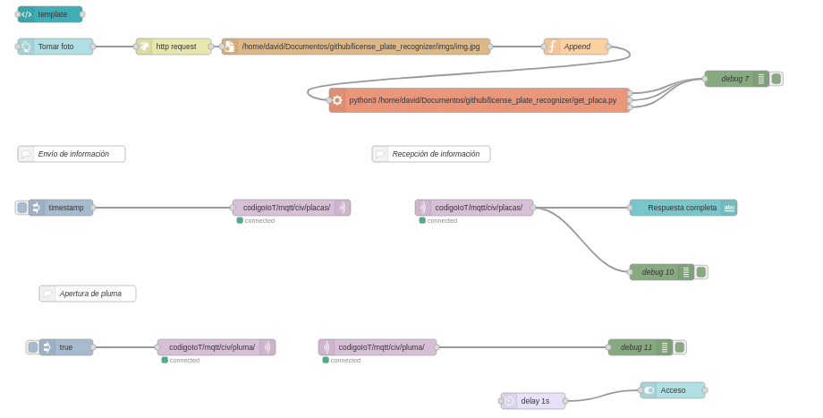
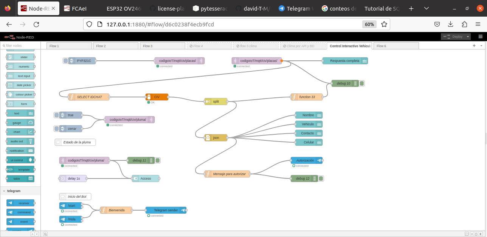
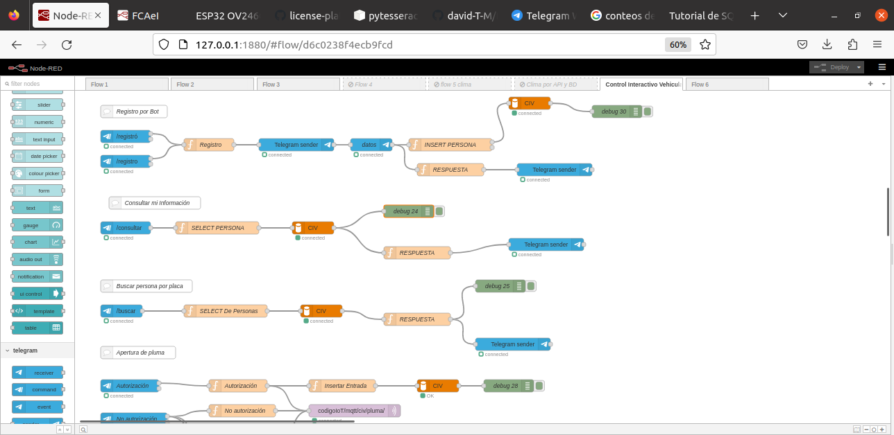
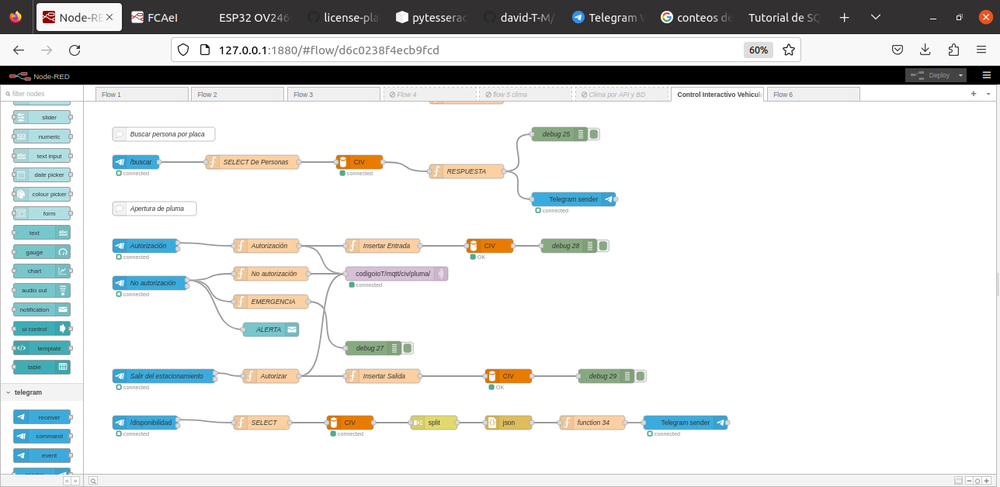

# ProyectoIOT
Proyecto del Diplomado de IoT

Descripción:	Este proyecto consiste en la automatización de un control de acceso vehicular, basado en un sistema de detección de placas vehiculares mediante el uso de microcontroladores y la aplicación de tecnologías del internet de las cosas (IOT)

Aplicaciones:	Control de entradas y salidas de vehículos de uso oficial de la universidad. Estacionamientos universitarios de diferentes unidades académicas. Empresas, organismos y asociaciones.

Objetivo general:	Incrementar el control de estacionamiento en el acceso y salida de los vehículos a través de la autorización y no autorización por parte del usuario al reducir la inseguridad de robo dentro de la universidad autónoma del Estado de Morelos.

Objetivos específicos:	Mayor seguridad dentro de la universidad mediante el control de accesos vehicular.	Automatización de un sistema de accesos.

Justificación:	Actualmente en distintas organizaciones a pesar de un equipo de vigilancia (recurso humano y tecnológico) y brindar espacios de estacionamientos para el uso exclusivo del personal, sigue habiendo mucha inseguridad debido a que se ha sustraído vehículos sin autorización del propietario. El uso de nuevas tecnologías de IoT permitirá tener al usuario un control y notificación de entrada y salida de su vehículo.
A continuación se muestran los flujos de trabajo desarrollados en Node-Red en la versión más actualizada.

Datos de las vesiones utilizadas en este proyecto:
Node-RED version: v3.0.2
Node.js  version: v16.20.0
Computadora con virtualización de Linux 5.15.0-73-generic x64 LE
Mqtt 5.0
Python 3.8.8

Nodos utilizados:
node-red
3.0.2
node-red-contrib-string
1.0.0
node-red-contrib-telegrambot
15.1.1
node-red-dashboard
3.1.7
node-red-node-mysql
1.0.3
node-red-node-ui-table
0.4.3

## Flujo Node-red

## Bot Telegram

## Interfaz gráfica:

En el documento "Kardex - Control Vehicular.docx" se puede encontrar la información necesaria para implementar el proyecto de IoT.

La ubicación del código para la ESP32-CAM con los sensores de cámara y servomotor se encuentran en la carpeta CameraWebServer/

La ubicación del código para la detección de placas a través del sensor de cámara se encuentran en la carpeta Detección de placas/

El json del flujo de Node-Red se encuentra en la carpeta Flujo Node-Red/